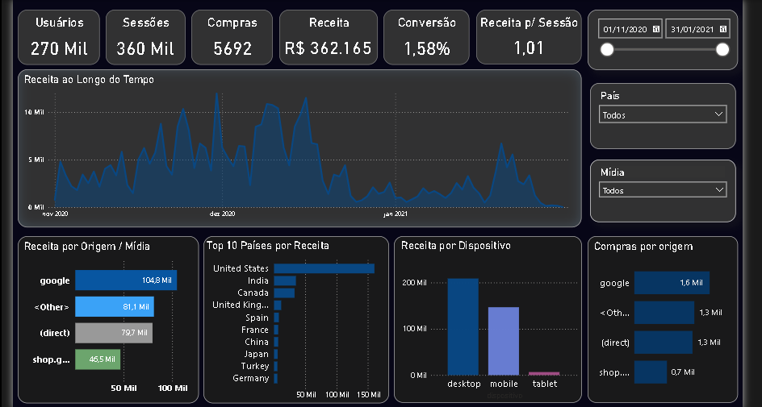
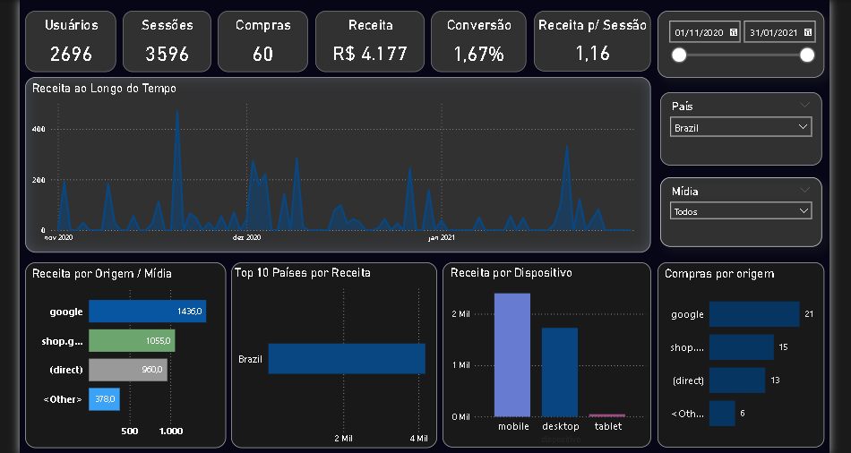

#  Google Merchandise Store (GA4) – Marketing Analytics Dashboard

Projeto de Marketing Analytics desenvolvido utilizando dados públicos do **Google Merchandise Store (GA4)**. O objetivo é construir um pipeline analítico completo, desde a extração e transformação dos dados no **Google BigQuery** até a criação de um dashboard interativo no **Microsoft Power BI**.

O projeto demonstra competências em SQL, modelagem de dados, Google Analytics 4, BigQuery, Power BI, DAX e Git/GitHub.

---

# 🎯 Objetivos do Projeto

- Analisar o comportamento dos usuários da Google Merchandise Store.
- Identificar padrões de receita, conversão e aquisição de usuários.
- Construir um dashboard executivo para análise de desempenho.
- Demonstrar um fluxo completo de Marketing Analytics utilizando ferramentas amplamente utilizadas pelo mercado.

---

#  Stack Tecnológica

| Ferramenta | Utilização |
|------------|------------|
| Google Analytics 4 | Fonte dos dados |
| Google BigQuery | Armazenamento e consultas SQL |
| SQL | Transformação dos dados |
| Microsoft Power BI | Dashboard e visualizações |
| DAX | Cálculo de métricas |
| Git | Versionamento |
| GitHub | Portfólio |

---

# 📂 Dataset

**Fonte**

Google Merchandise Store (GA4)

Dataset público disponível no Google BigQuery:

```text
bigquery-public-data.ga4_obfuscated_sample_ecommerce.events_*
```

Período analisado:

- Novembro/2020
- Dezembro/2020
- Janeiro/2021

---

#  Arquitetura da Solução

```text
Google Merchandise Store (GA4)
            │
            ▼
Google BigQuery
(SQL)
            │
            ▼
Tabela Analítica (dashboard)
            │
            ▼
Microsoft Power BI
            │
            ▼
Dashboard Executivo
```

---

# 📁 Estrutura do Projeto

```text
marketing_analytics_ga4/
│
├── powerbi/
│   └── marketing_analytics_ga4.pbix
│
├── sql/
│   ├── 01_exploracao_dataset.sql
│   ├── 02_eventos.sql
│   ├── 03_usuarios_sessoes.sql
│   ├── 04_funil_conversao.sql
│   ├── 05_receita.sql
│   ├── 06_produtos.sql
│   ├── 07_origem_trafego.sql
│   ├── 08_dashboard.sql
│   ├── 09_dispositivo_localizacao.sql
│   └── 10_kpi_dashboard.sql
│
├── images/
│    ├── dashboard_1
│    └── dashboard_2
├── README.md
│
└── .gitignore
```

---

#  Pipeline de Dados

1. Consulta dos dados públicos do Google Analytics 4.
2. Exploração da estrutura do dataset.
3. Construção das consultas SQL no BigQuery.
4. Criação da tabela analítica para consumo no Power BI.
5. Desenvolvimento das medidas DAX.
6. Construção do dashboard interativo.
7. Publicação do projeto no GitHub.

---

# 📈 Dashboard

Global



______________________________________
Brasil


```

---

# 📊 Principais KPIs

O dashboard apresenta os seguintes indicadores:

- Usuários
- Sessões
- Compras
- Receita
- Taxa de Conversão
- Receita por Sessão

Também contempla análises de:

- Receita ao longo do tempo
- Receita por Origem / Mídia
- Receita por Dispositivo
- Top 10 Países por Receita
- Compras por Origem

Filtros disponíveis:

- Data
- País
- Mídia

---

# 💡 Principais Insights

- Os **Estados Unidos** concentraram a maior parte da receita do período.
- O canal **Google** foi a principal origem de receita.
- O dispositivo **Desktop** apresentou o maior volume de receita.
- A taxa geral de conversão foi de aproximadamente **1,58%**.
- O comportamento da receita apresentou sazonalidade ao longo do período analisado.

---

#  Como Executar o Projeto

## 1. Clonar o repositório

```bash
git clone https://github.com/JulioPeniche/Marketing_Analytics_GA4.git
```

## 2. Executar os scripts SQL

Execute os arquivos da pasta `sql/` no Google BigQuery.

## 3. Abrir o Power BI

Abra o arquivo:

```text
powerbi/marketing_analytics_ga4.pbix
```

Atualize a conexão com o BigQuery caso necessário.

---

# 📚 Aprendizados

Durante o desenvolvimento deste projeto foram aplicados conceitos de:

- Google Analytics 4
- BigQuery
- SQL Analítico
- Modelagem de Dados
- Power BI
- DAX
- Visualização de Dados
- Git e GitHub

---

#  Autor

**Julio Peniche**

LinkedIn: * https://www.linkedin.com/in/julio-peniche-cloud/
